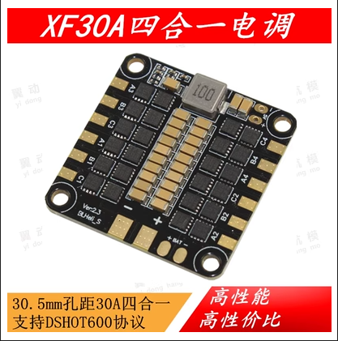
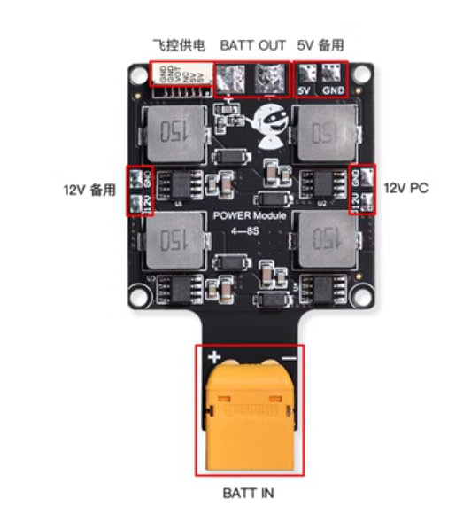

### 1.设计要求

1. 尺寸，这个东西的尺寸的样子(30.50mm孔距)
2. 
3. 电源输入: 4S-6S
4. 电源输出:
   1. 直出/45A 四路
   2. 12V/5A 一路
   3. 5V/5A 一路
5. 将PMU相关的东西进行集成
6. PMU本身应该是既有I2C通讯的，又有模拟量通讯的，只需要模拟量就可以

### 2. TODOs

1. 看一下这个电流信息到底是怎么传出去的
2. 一定要是牢固可靠的5V供电，优雅的测试流程
3. 
4. 阿木实验室的这个可以尽量参考
5. 

### 3. 验证方法和测试代码

### 3.可能发生的最坏的事情

1. 12V转压故障，导致12V直出电源电压烧坏后级电脑、无人机炸机

Some Qs

1. 孔间距是30.50mm, 但是孔大小看了一些发现有3mm的，有4mm的，所以到底采用哪一种比较好，现在是3mm
2.
