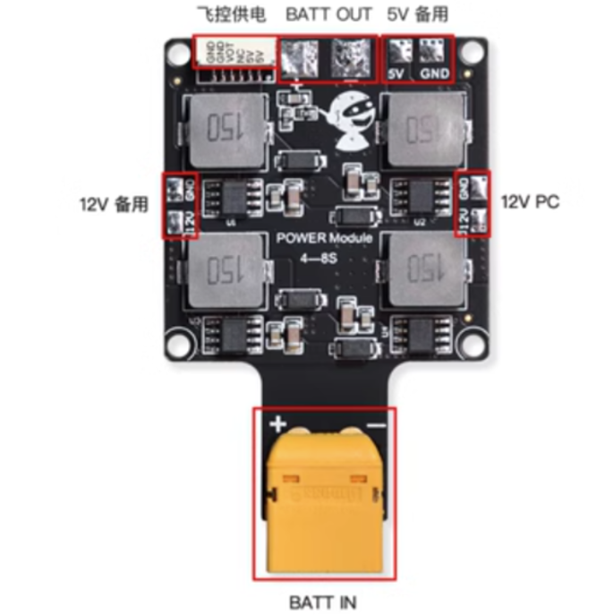
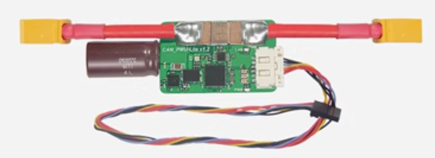
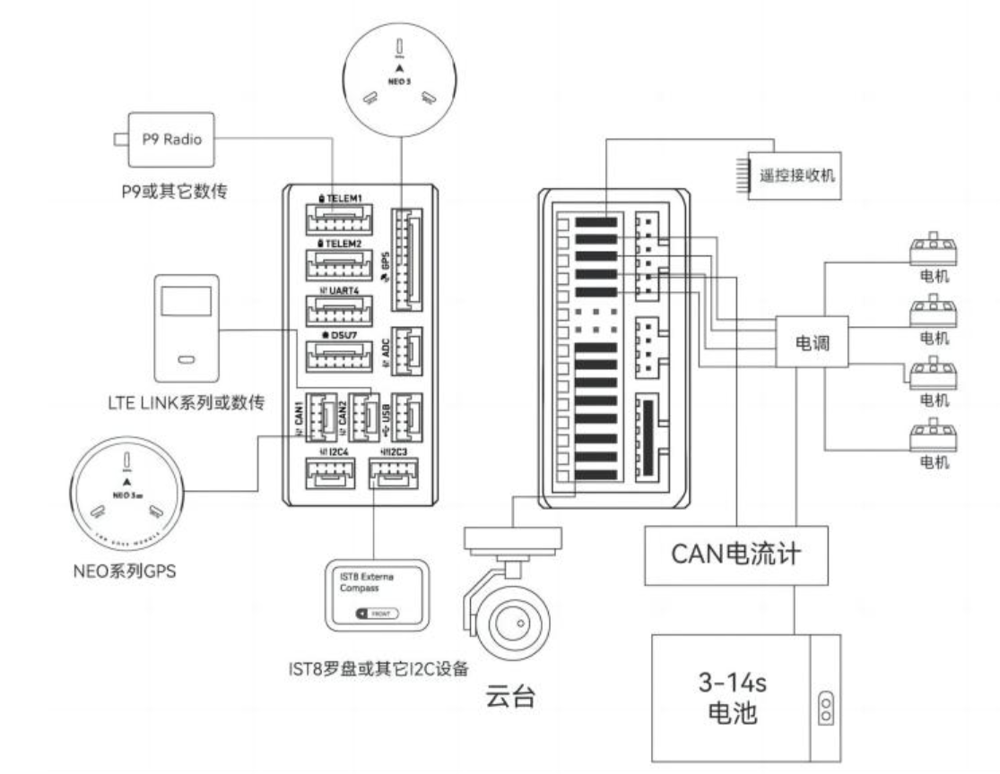
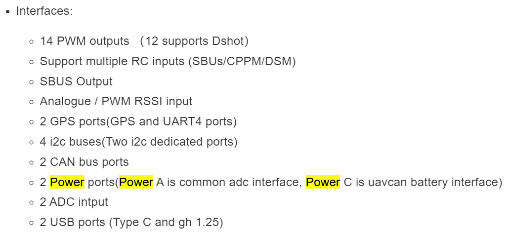
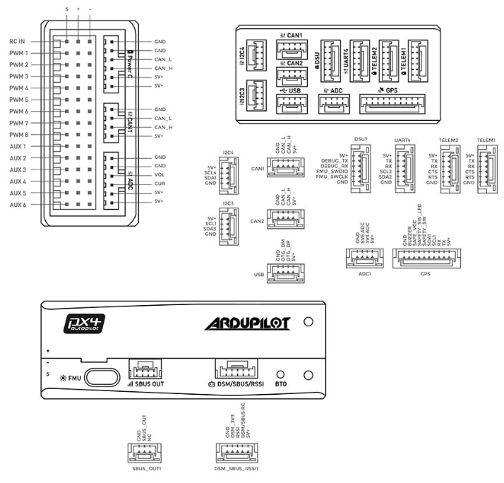
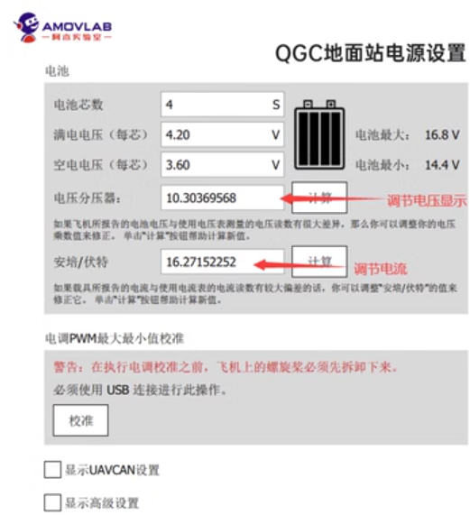
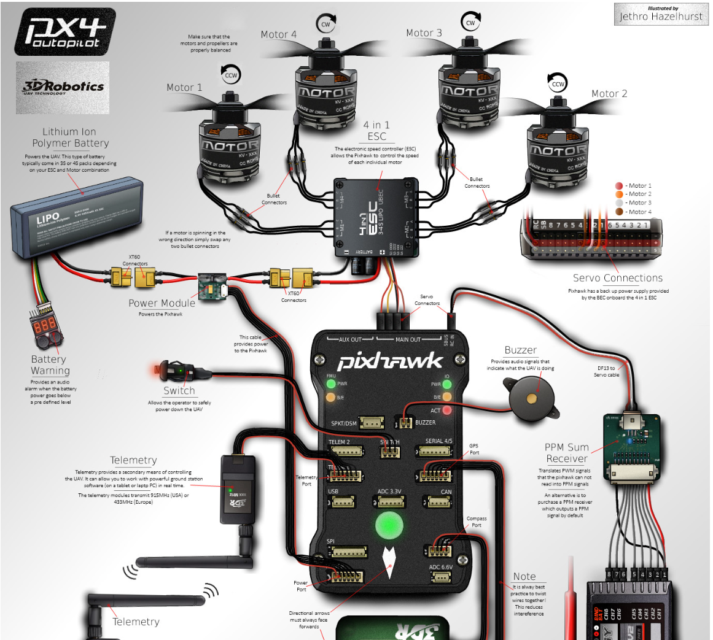

### 1.设计要求

1. 尺寸，30.50mm孔距
2. 电源输入: 4S-6S(14-25.2V)
3. 电源输出:
   * 直出/45A 四路
   * 12V/7.5A 一路
   * 5V/5A 一路
4. 将PMU相关的东西进行集成(5V转压+飞控供电+采样电阻+模拟信号)(CAN信号先留着，下一版再说)

### 2. 设计要求分析

1. 12V是用来给Nvidia的系列模组供电的，根据目前(2023.11.11)的各个模组的功耗情况，可以得知**Jeston AGX Origin 64GB**需要15W-60W的电源，所以保险起见需要提供12V/7.5A=90W的一路电源 *[Reference](https://www.nvidia.com/en-sg/autonomous-machines/embedded-systems/jetson-orin/)*
2. 5V是用来给飞控供电的，飞控5V/5A 一路

3. PMU设计分析: PMU在正常情况下是这样的一个模块，其他一些名称有飞行电流计 CAN电流计 *[Reference](https://item.taobao.com/item.htm?spm=a21n57.1.0.0.57e4523cPJaut3&id=620349108685&ns=1&abbucket=3#detail)*

> * 正常的飞控，以Nora+为例，一般会拥有两个供电的输入端口，称为PowerA和PowerC，根据下图的解释可以知道，PowerA是正常的ADC信息+供电的通道，PowerC是CAN信息+供电的通道
>
> 

> * 飞控的电源输入的正常的6pin线序为下图所示，具有VOL和CUR，分别表示输入电压和输入电流
> 

### 3. 方案选型
> * 采用PowerA端口，提供ADC信息
> * 电流采样: 采用0.25mr采样电阻，采用INA240A1进行200倍增益放大，输出模拟电流采样值，安培/伏特选择20
> * 电压采样: 采用TLV2372IDR运放，采样电源的输入电压，电压分压器选择10
> 

> 
> * 转压芯片选型
> 
> |芯片名称|厂家|输入电压范围|输出电压范围|输出电流max|优缺点|
> | :---  | :----: | :---: |:---:      | :---:     |  :---:   |
> | LT8645SIV#PBF | ADI(亚德诺) | 3.4V-65V| 1.8V~12V| 8A |49.15/片 难焊 |
> | SIC461ED-T1-GE3 | VISHAY(威世)| 4.5V-60V | 800mV~55.2V |10A | 14.02/片 正常焊 |
> | SIC471ED-T1-GE3 | VISHAY(威世)| 4.5V-55V | 800mV~50.6V |12A | 17.65/片 正常焊 |
> | FAN65008B | onsemi(安森美)| 4.5V-65V | 600mV~32.5V |10A | 32/片 正常焊 |
>
> * 采用SIC461ED-T1-GE3进行 **输入电压** 转 **12V** ，效率在96-97%
> * 采用SIC461ED-T1-GE3进行 **输入电压** 转 **5V** ，效率在94-95%

### 3.可能发生的最坏的事情

1. 12V转压故障，导致12V直出电源电压烧坏后级电脑、无人机炸机
2. 飞控6pin引脚线序画反或者接线反导致烧飞控
3. 飞控模拟电压采样出问题烧飞控

Some Qs

1. 孔间距是30.50mm, 但是孔大小看了一些发现有3mm的，有4mm的，所以到底采用哪一种比较好，现在是3mm
2. 

