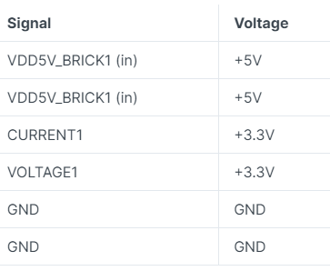
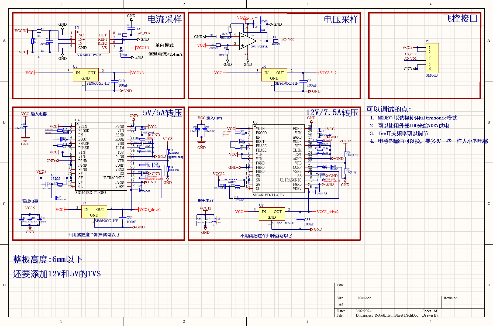
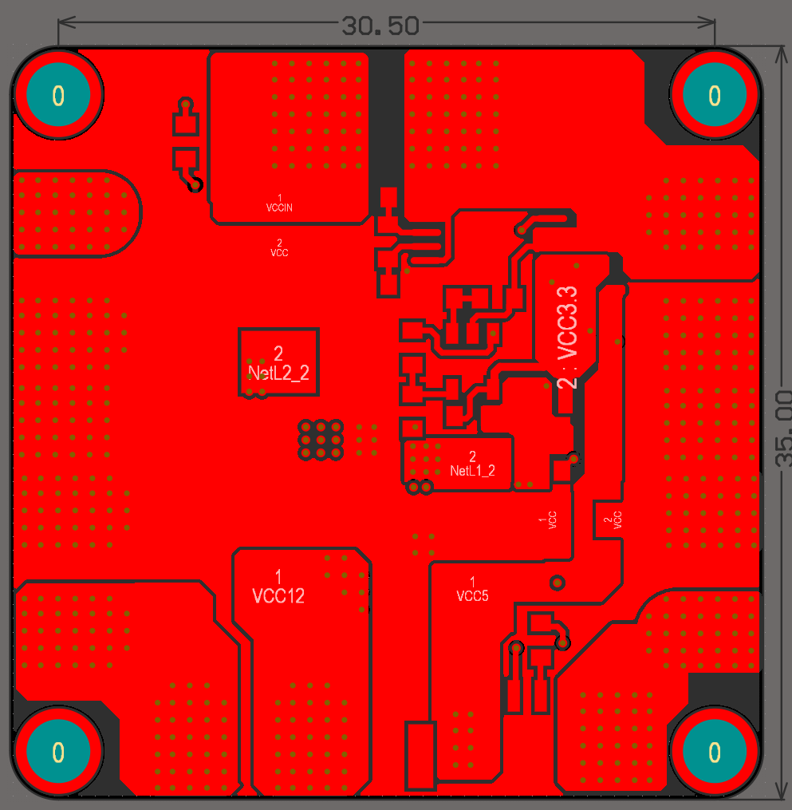
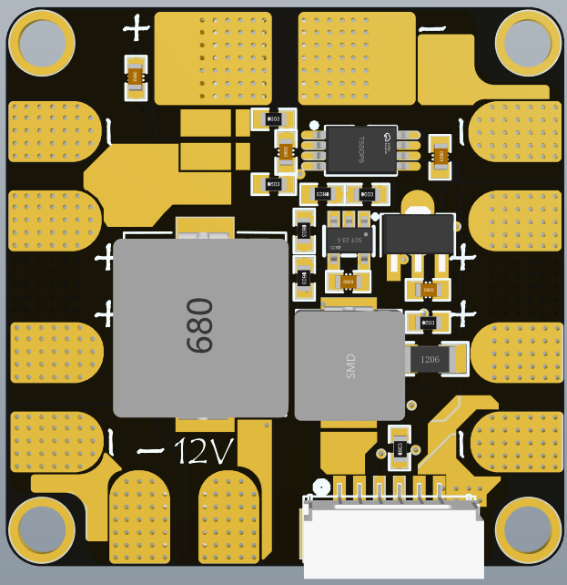
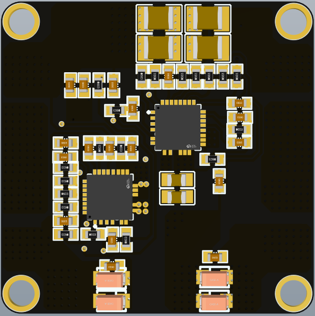

### 1.设计要求

1. 尺寸，30.50mm孔距
2. 电源输入: 4S-6S(14-25.2V)
3. 电源输出:
   * 直出/45A 四路
   * 12V/7.5A 一路
   * 5V/5A 一路
4. 将PMU相关的东西进行集成(5V转压+飞控供电+采样电阻+模拟信号)(CAN信号先留着，下一版再说)

### 2. 设计要求分析

1. 12V是用来给Nvidia的系列模组供电的，根据目前(2023.11.11)的各个模组的功耗情况，可以得知**Jeston AGX Origin 64GB**需要15W-60W的电源，所以保险起见需要提供12V/7.5A=90W的一路电源 *[Reference](https://www.nvidia.com/en-sg/autonomous-machines/embedded-systems/jetson-orin/)*
2. 5V是用来给飞控供电的，飞控5V/5A 一路

3. PMU设计分析: PMU在正常情况下是这样的一个模块，其他一些名称有飞行电流计 CAN电流计 *[Reference](https://item.taobao.com/item.htm?spm=a21n57.1.0.0.57e4523cPJaut3&id=620349108685&ns=1&abbucket=3#detail)*

> * 正常的飞控，以Nora+为例，一般会拥有两个供电的输入端口，称为PowerA和PowerC，根据下图的解释可以知道，PowerA是正常的ADC信息+供电的通道，PowerC是CAN信息+供电的通道
>
> 

> * 飞控的电源输入的正常的6pin线序为下图所示，具有VOL和CUR，分别表示输入电压和输入电流
>
> 

### 3. 方案选型

> * 采用PowerA端口，提供ADC信息
> * 电流采样: 采用0.25mr采样电阻，采用INA240A3进行100倍增益放大，输出模拟电流采样值，安培/伏特写入40
> * 电压采样: 采用OPA171AIDBVR运放，采样电源的输入电压，电压分压器写入16
>
> 

>
> * 分压器设计采样范围
>
> 

>
> * 转压芯片选型
>
> | 芯片名称        |      厂家      | 输入电压范围 | 输出电压范围 | 输出电流max |     优缺点     |
> | :-------------- | :------------: | :----------: | :----------: | :---------: | :-------------: |
> | LT8645SIV#PBF   |  ADI(亚德诺)  |   3.4V-65V   |   1.8V~12V   |     8A     |  49.15/片 难焊  |
> | SIC461ED-T1-GE3 |  VISHAY(威世)  |   4.5V-60V   | 800mV~55.2V |     10A     | 14.02/片 正常焊 |
> | SIC471ED-T1-GE3 |  VISHAY(威世)  |   4.5V-55V   | 800mV~50.6V |     12A     | 17.65/片 正常焊 |
> | FAN65008B       | onsemi(安森美) |   4.5V-65V   | 600mV~32.5V |     10A     |  32/片 正常焊  |
>
> * 采用SIC461ED-T1-GE3进行 **输入电压** 转 **12V** ，效率在96-97%
> * 采用SIC461ED-T1-GE3进行 **输入电压** 转 **5V** ，效率在94-95%

### 4.原理图及PCB

#### 4.1 原理图

#### 4.2 PCB

### 5.待办

1. 12V转压相关的东西还要计算(12V现在的相关参数都是搬的5V的相关参数)
2. 优化一下布局，重新考虑一下布板，现在的大电流相关的东西还需要重新进行考虑
3. 在飞控引脚和12V引脚处加标注
4. 把使用注意事项写到板子的背面

### 6.测试

1. 空载，满载电压准确度
2. 空载，满载电源纹波(在满载的时候纹波在50mV以下)
3. 动态响应度(突然加载和掉载的时候)(在300mV以内可以接受)
4. 发热情况(温度越低越好，满载5min不要高于60度)
5. 效率(任意负载高于96%)
6. 加入输出的12V和5V TVS

### 7.异常测试

1. 镊子输出短路查看响应
2. 开关串联输入查看模块是否会烧毁
3. 动态响应度(突然加载和掉载的时候)(在300mV以内可以接受)
4. 发热情况(温度越低越好，满载5min不要高于50度)
5. 效率(任意负载高于96%)
6. 加入输出的12V和5V TVS

### 8.可能发生的最坏的事情

1. 12V转压故障，导致12V直出电源电压烧坏后级电脑、无人机炸机
2. 飞控6pin引脚线序画反或者接线反导致烧飞控
3. 飞控模拟电压采样出问题烧飞控
4.

### 9.使用注意

1. 5V路禁止同时给舵机或其他电机供电
2. 12V禁止同时给其他舵机或者电机供电
3.

