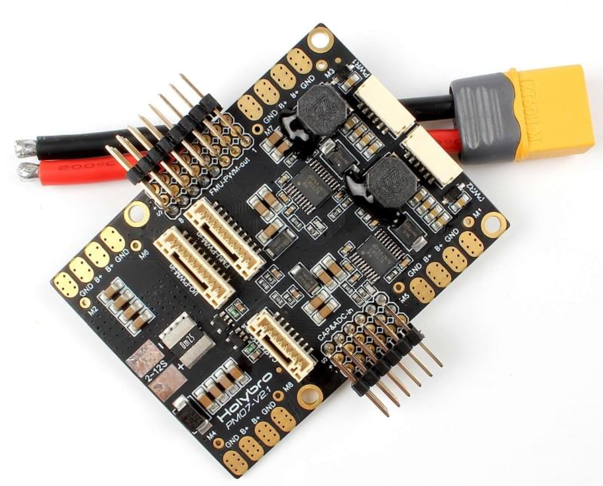
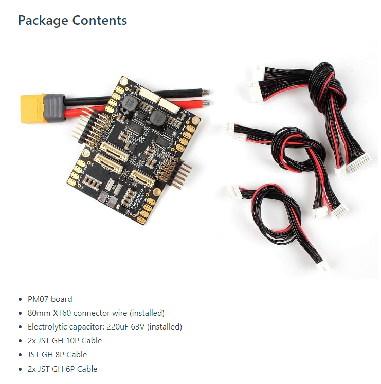
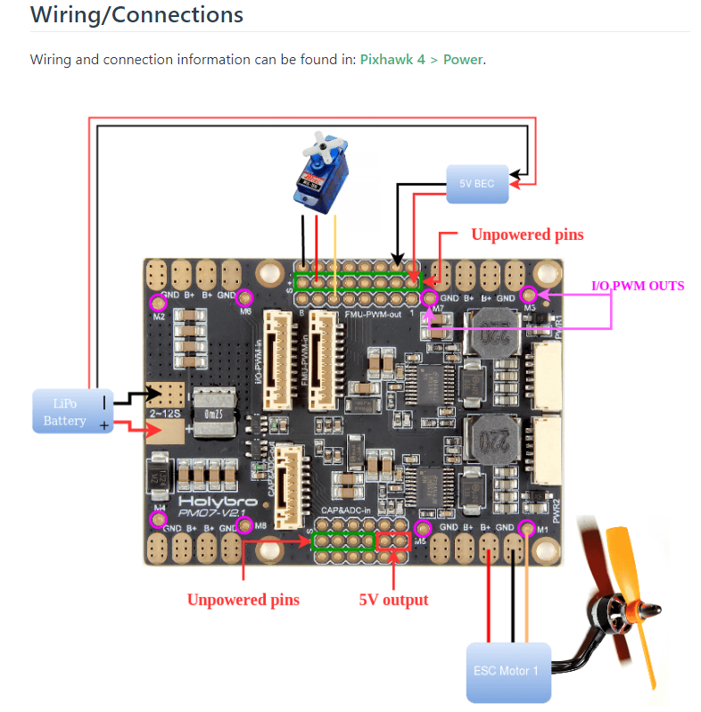

## PM07 Board

#### Chip Used

LM5576 for 5V/3A output

[https://docs.px4.io/main/en/power_module/holybro_pm07_pixhawk4_power_module.html](https://docs.px4.io/main/en/power_module/holybro_pm07_pixhawk4_power_module.html)

* **PCB Current:** total 120A outputs (MAX)
* **UBEC 5v output current:** 3A
* **UBEC input voltage:** 2~12s LiPo
* **Dimensions:** 68 x 50 x 8 mm
* **Mounting Holes:** 45 x 45 mm
* **Weight:** 36g

## 清单内容

