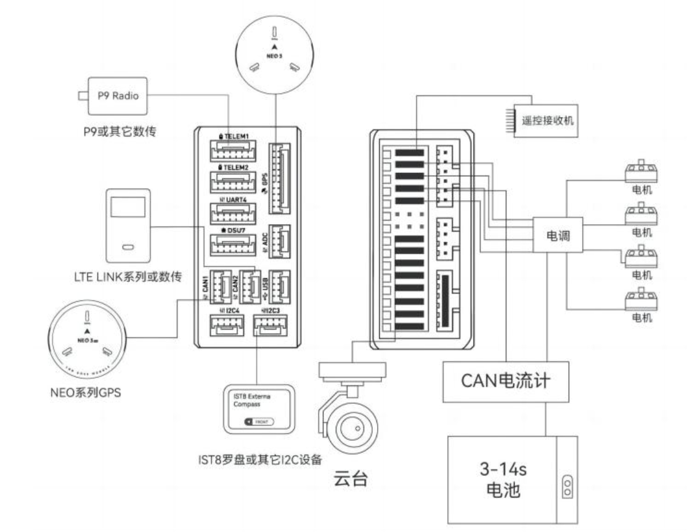

### 1.设计要求

1. 尺寸，30.50mm孔距
2. 电源输入: 4S-6S(14-25.2V)
3. 电源输出:
   * 直出/45A 四路
   * 12V/7.5A 一路
   * 5V/5A 一路
4. 将PMU相关的东西进行集成(5V转压+飞控供电+采样电阻+模拟信号)(CAN信号先留着，下一版再说)

### 2. 设计要求分析

1. 12V是用来给Nvidia的系列模组供电的，根据目前(2023.11.11)的各个模组的功耗情况，可以得知**Jeston AGX Origin 64GB**需要15W-60W的电源，所以保险起见需要提供12V/7.5A 一路电源 *[Reference](https://www.nvidia.com/en-sg/autonomous-machines/embedded-systems/jetson-orin/)*
2. 5V是用来给飞控供电的，飞控5V/5A 一路

3. PMU设计分析: PMU在正常情况下是这样的一个模块，其他一些名称有飞行电流计 CAN电流计 *[Reference](https://item.taobao.com/item.htm?spm=a21n57.1.0.0.57e4523cPJaut3&id=620349108685&ns=1&abbucket=3#detail)*

> 正常的飞控，以Nora+为例，一般会拥有两个供电的输入端口，称为PowerA和PowerC，根据下图的解释可以知道，PowerA是正常的ADC信息+供电的通道，PowerC是CAN信息+供电的通道
> 

> 
1. 

### 3. 验证方法和测试代码

### 3.可能发生的最坏的事情

1. 12V转压故障，导致12V直出电源电压烧坏后级电脑、无人机炸机

Some Qs

1. 孔间距是30.50mm, 但是孔大小看了一些发现有3mm的，有4mm的，所以到底采用哪一种比较好，现在是3mm
2.
